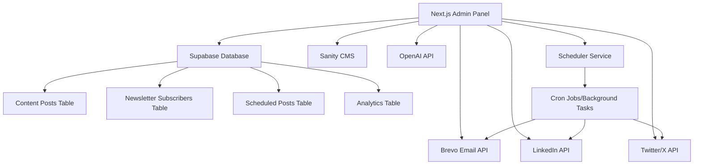

# Design Document

## Overview

The admin panel and content automation system will be built as an integrated part of the existing Next.js application, leveraging the current Sanity CMS setup while adding new capabilities for social media management, newsletter subscriptions, and AI-powered content generation. The system will use a modern tech stack including Supabase for database operations, Brevo for email delivery, OpenAI for content generation, and social media APIs for automated posting.

## Architecture

### High-Level Architecture



### Technology Stack

- **Frontend**: Next.js 14 with TypeScript, Tailwind CSS, shadcn/ui components
- **Database**: Supabase (PostgreSQL) for new data, Sanity CMS for blog content
- **Authentication**: Supabase Auth or NextAuth.js
- **Email Service**: Brevo (formerly Sendinblue) API
- **AI Integration**: OpenAI GPT API for content generation
- **Social Media**: LinkedIn API, Twitter/X API
- **Scheduling**: Node-cron or similar for background tasks
- **State Management**: React Query/TanStack Query for server state

## Components and Interfaces

### 1. Admin Dashboard Layout

**Location**: `/app/admin/page.tsx`

**Components**:
- `AdminSidebar`: Navigation menu with sections for Dashboard, Blog Posts, Social Media, Newsletter, Analytics
- `DashboardStats`: Overview cards showing content metrics, subscriber counts, scheduled posts
- `RecentActivity`: Timeline of recent content creation and publishing activities
- `QuickActions`: Buttons for common tasks like "Create Blog Post", "Schedule Social Post"

### 2. Blog Management Interface

**Location**: `/app/admin/blog/page.tsx`

**Components**:
- `BlogPostList`: Table/grid view of all blog posts with status indicators
- `BlogPostEditor`: Enhanced editor that integrates with Sanity Studio
- `AIContentAssistant`: Sidebar component for AI-powered content suggestions
- `SocialMediaPreview`: Preview how blog content will appear on social platforms

### 3. Social Media Management

**Location**: `/app/admin/social/page.tsx`

**Components**:
- `SocialPostComposer`: Multi-platform post creation interface
- `ContentCalendar`: Calendar view showing all scheduled content
- `PlatformTabs`: Separate views for LinkedIn and Twitter/X content
- `PostScheduler`: Date/time picker with optimal timing suggestions
- `SocialAnalytics`: Engagement metrics and performance data

### 4. Newsletter Management

**Location**: `/app/admin/newsletter/page.tsx`

**Components**:
- `SubscriberManager`: Table for managing email subscribers
- `NewsletterComposer`: Rich text editor for creating newsletters
- `EmailTemplates`: Pre-designed templates for different newsletter types
- `CampaignAnalytics`: Open rates, click rates, and subscriber growth metrics

### 5. AI Content Generation

**Location**: Integrated across all content creation interfaces

**Components**:
- `AIPromptInterface`: Input field for content generation requests
- `ContentSuggestions`: AI-generated ideas and improvements
- `TopicResearcher`: AI-powered research and fact-checking
- `SEOOptimizer`: AI suggestions for search engine optimization

## Data Models

### Supabase Database Schema

```sql
-- Social Media Posts
CREATE TABLE social_posts (
  id UUID PRIMARY KEY DEFAULT gen_random_uuid(),
  platform VARCHAR(20) NOT NULL, -- 'linkedin' or 'twitter'
  content TEXT NOT NULL,
  media_urls TEXT[],
  scheduled_at TIMESTAMP WITH TIME ZONE,
  published_at TIMESTAMP WITH TIME ZONE,
  status VARCHAR(20) DEFAULT 'draft', -- 'draft', 'scheduled', 'published', 'failed'
  engagement_metrics JSONB,
  created_at TIMESTAMP WITH TIME ZONE DEFAULT NOW(),
  updated_at TIMESTAMP WITH TIME ZONE DEFAULT NOW()
);

-- Newsletter Subscribers
CREATE TABLE newsletter_subscribers (
  id UUID PRIMARY KEY DEFAULT gen_random_uuid(),
  email VARCHAR(255) UNIQUE NOT NULL,
  first_name VARCHAR(100),
  last_name VARCHAR(100),
  status VARCHAR(20) DEFAULT 'active', -- 'active', 'unsubscribed', 'bounced'
  subscribed_at TIMESTAMP WITH TIME ZONE DEFAULT NOW(),
  unsubscribed_at TIMESTAMP WITH TIME ZONE,
  tags TEXT[]
);

-- Newsletter Campaigns
CREATE TABLE newsletter_campaigns (
  id UUID PRIMARY KEY DEFAULT gen_random_uuid(),
  subject VARCHAR(255) NOT NULL,
  content TEXT NOT NULL,
  template_id VARCHAR(100),
  scheduled_at TIMESTAMP WITH TIME ZONE,
  sent_at TIMESTAMP WITH TIME ZONE,
  status VARCHAR(20) DEFAULT 'draft', -- 'draft', 'scheduled', 'sent', 'failed'
  recipient_count INTEGER DEFAULT 0,
  open_rate DECIMAL(5,2),
  click_rate DECIMAL(5,2),
  created_at TIMESTAMP WITH TIME ZONE DEFAULT NOW()
);

-- Content Analytics
CREATE TABLE content_analytics (
  id UUID PRIMARY KEY DEFAULT gen_random_uuid(),
  content_type VARCHAR(20) NOT NULL, -- 'blog', 'social', 'newsletter'
  content_id VARCHAR(255) NOT NULL,
  platform VARCHAR(20),
  views INTEGER DEFAULT 0,
  likes INTEGER DEFAULT 0,
  shares INTEGER DEFAULT 0,
  comments INTEGER DEFAULT 0,
  clicks INTEGER DEFAULT 0,
  recorded_at TIMESTAMP WITH TIME ZONE DEFAULT NOW()
);

-- AI Generated Content Log
CREATE TABLE ai_content_log (
  id UUID PRIMARY KEY DEFAULT gen_random_uuid(),
  prompt TEXT NOT NULL,
  generated_content TEXT NOT NULL,
  content_type VARCHAR(20) NOT NULL,
  tokens_used INTEGER,
  created_at TIMESTAMP WITH TIME ZONE DEFAULT NOW()
);
```

### API Integration Models

```typescript
// OpenAI Integration
interface AIContentRequest {
  prompt: string;
  contentType: 'blog' | 'social' | 'newsletter';
  platform?: 'linkedin' | 'twitter';
  tone?: 'professional' | 'casual' | 'engaging';
  maxLength?: number;
}

interface AIContentResponse {
  content: string;
  suggestions: string[];
  seoKeywords?: string[];
  tokensUsed: number;
}

// Social Media APIs
interface SocialPostData {
  platform: 'linkedin' | 'twitter';
  content: string;
  mediaUrls?: string[];
  scheduledAt?: Date;
}

interface SocialPostResponse {
  postId: string;
  status: 'published' | 'scheduled' | 'failed';
  url?: string;
  error?: string;
}

// Brevo Email API
interface NewsletterData {
  subject: string;
  htmlContent: string;
  recipients: string[];
  templateId?: number;
  scheduledAt?: Date;
}
```

## Error Handling

### API Error Management

1. **Graceful Degradation**: If AI services are unavailable, provide manual content creation options
2. **Retry Logic**: Implement exponential backoff for failed API calls
3. **User Feedback**: Clear error messages and suggested actions for users
4. **Logging**: Comprehensive error logging for debugging and monitoring

### Data Validation

1. **Input Sanitization**: Validate all user inputs before processing
2. **Content Moderation**: Basic checks for inappropriate content before publishing
3. **Rate Limiting**: Prevent API abuse and respect service limits
4. **Backup Systems**: Fallback options when primary services fail

## Testing Strategy

### Unit Testing

- **Components**: Test all React components with Jest and React Testing Library
- **API Functions**: Test all API integration functions with mock responses
- **Database Operations**: Test Supabase queries and mutations
- **AI Integration**: Mock OpenAI responses for consistent testing

### Integration Testing

- **End-to-End Workflows**: Test complete content creation and publishing flows
- **API Integration**: Test actual API connections in staging environment
- **Database Transactions**: Verify data consistency across operations
- **Authentication**: Test admin access controls and security

### Performance Testing

- **Load Testing**: Ensure system handles multiple concurrent users
- **API Response Times**: Monitor and optimize API call performance
- **Database Queries**: Optimize database operations for speed
- **Content Generation**: Test AI response times and token usage

## Security Considerations

### Authentication & Authorization

- **Admin Access**: Secure admin panel with proper authentication
- **API Keys**: Secure storage of all API keys using environment variables
- **Role-Based Access**: Different permission levels for different admin users
- **Session Management**: Secure session handling and timeout policies

### Data Protection

- **Email Privacy**: Secure handling of subscriber email addresses
- **Content Security**: Prevent unauthorized content modification
- **API Security**: Secure API endpoints with proper validation
- **Database Security**: Use Supabase Row Level Security (RLS) policies

## Deployment and Configuration

### Environment Variables

```env
# Supabase
NEXT_PUBLIC_SUPABASE_URL=your_supabase_url
NEXT_PUBLIC_SUPABASE_ANON_KEY=your_supabase_anon_key
SUPABASE_SERVICE_ROLE_KEY=your_service_role_key

# OpenAI
OPENAI_API_KEY=your_openai_api_key

# Brevo
BREVO_API_KEY=your_brevo_api_key

# Social Media APIs
LINKEDIN_CLIENT_ID=your_linkedin_client_id
LINKEDIN_CLIENT_SECRET=your_linkedin_client_secret
TWITTER_API_KEY=your_twitter_api_key
TWITTER_API_SECRET=your_twitter_api_secret
TWITTER_ACCESS_TOKEN=your_twitter_access_token
TWITTER_ACCESS_TOKEN_SECRET=your_twitter_access_token_secret

# Admin Authentication
ADMIN_USERNAME=your_admin_username
ADMIN_PASSWORD=your_admin_password_hash
NEXTAUTH_SECRET=your_nextauth_secret
```

### Database Setup

1. **Supabase Project**: Create tables using the provided SQL schema
2. **RLS Policies**: Set up Row Level Security for data protection
3. **API Access**: Configure Supabase API keys and permissions
4. **Backup Strategy**: Regular database backups and recovery procedures

## Implementation Phases

### Phase 1: Core Infrastructure
- Set up Supabase database and authentication
- Create basic admin panel layout and navigation
- Implement core data models and API connections

### Phase 2: Content Management
- Enhance blog management with AI integration
- Build social media post creation and scheduling
- Implement newsletter subscriber management

### Phase 3: Automation & Analytics
- Add content automation rules and suggestions
- Implement analytics tracking and reporting
- Build content calendar and scheduling system

### Phase 4: Advanced Features
- AI-powered content optimization
- Advanced analytics and insights
- Performance optimization and monitoring