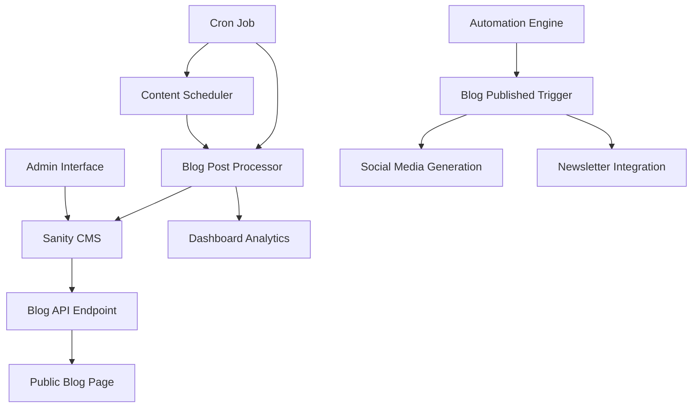

# Design Document

## Overview

The blog content automation testing system will establish a complete end-to-end workflow for blog content creation, scheduling, and publication. The design addresses the current disconnect between the static blog page and the dynamic Sanity CMS-powered admin system by implementing dynamic content fetching, proper scheduling mechanisms, and comprehensive testing procedures.

## Architecture

### Current System Analysis

The existing system has the following components:
- **Static Blog Page**: Currently displays hardcoded blog posts at `/blog`
- **Admin Interface**: Uses Sanity CMS for content management at `/admin/blog`
- **Sanity CMS**: Stores blog posts with proper schema (title, slug, author, content, publishedAt, etc.)
- **Content Scheduler**: Exists for social media and newsletters but not integrated with blog posts
- **Automation Engine**: Handles rule-based content automation

### Proposed Architecture



## Components and Interfaces

### 1. Dynamic Blog Page Component

**Purpose**: Replace static blog page with dynamic content from Sanity CMS

**Interface**:
```typescript
interface BlogPageProps {
  posts: BlogPost[]
  pagination?: {
    currentPage: number
    totalPages: number
    hasNext: boolean
    hasPrev: boolean
  }
}

interface BlogPost {
  _id: string
  title: string
  slug: { current: string }
  author?: { name: string }
  mainImage?: { asset: { url: string }, alt?: string }
  categories?: Array<{ title: string }>
  publishedAt?: string
  excerpt?: string
  body?: any[]
  _createdAt: string
  _updatedAt: string
}
```

### 2. Blog Post Scheduler Service

**Purpose**: Handle scheduled publication of blog posts

**Interface**:
```typescript
interface BlogSchedulerService {
  getScheduledPosts(): Promise<BlogPost[]>
  processScheduledPosts(): Promise<ProcessingResult>
  schedulePost(postId: string, publishAt: Date): Promise<boolean>
  unschedulePost(postId: string): Promise<boolean>
}

interface ProcessingResult {
  processed: number
  published: number
  failed: number
  errors: string[]
}
```

### 3. Blog Content API Endpoints

**Purpose**: Provide API endpoints for blog content management and processing

**Endpoints**:
- `GET /api/blog/posts` - Fetch published blog posts for public consumption
- `GET /api/admin/blog/scheduled` - Get scheduled blog posts
- `POST /api/admin/blog/process-scheduled` - Process scheduled blog posts
- `POST /api/admin/blog/test-scheduler` - Create test posts for scheduler testing

### 4. Blog Analytics Integration

**Purpose**: Track blog post performance and integrate with dashboard

**Interface**:
```typescript
interface BlogAnalytics {
  trackPostView(postId: string): Promise<void>
  getPostMetrics(postId: string): Promise<PostMetrics>
  getBlogStats(): Promise<BlogStats>
}

interface PostMetrics {
  views: number
  shares: number
  engagement: number
  publishedAt: Date
}
```

## Data Models

### Enhanced Blog Post Model

The existing Sanity schema will be extended with scheduling and analytics fields:

```typescript
interface EnhancedBlogPost extends BlogPost {
  status: 'draft' | 'scheduled' | 'published' | 'archived'
  scheduledAt?: string
  autoPublish: boolean
  seoMetadata?: {
    metaTitle?: string
    metaDescription?: string
    keywords?: string[]
  }
  analytics?: {
    views: number
    shares: number
    lastViewed?: string
  }
}
```

### Scheduler Queue Model

```typescript
interface SchedulerQueueItem {
  id: string
  type: 'blog_post'
  contentId: string
  scheduledAt: Date
  status: 'pending' | 'processing' | 'completed' | 'failed'
  retryCount: number
  lastError?: string
  createdAt: Date
  updatedAt: Date
}
```

## Error Handling

### 1. Content Fetching Errors

- **Sanity API Failures**: Implement fallback to cached content or show appropriate error message
- **Network Issues**: Retry mechanism with exponential backoff
- **Invalid Content**: Validate content structure and skip malformed posts

### 2. Scheduling Errors

- **Database Connection Issues**: Queue operations for retry when connection is restored
- **Invalid Schedule Times**: Validate schedule times and provide user feedback
- **Processing Failures**: Implement retry logic with maximum attempt limits

### 3. User Experience Errors

- **Empty Blog Page**: Show appropriate message when no published posts exist
- **Loading States**: Implement skeleton loading for better UX
- **Error Boundaries**: Catch and handle React component errors gracefully

## Testing Strategy

### 1. Unit Testing

**Blog Components**:
- Test blog page rendering with various post states
- Test post filtering and sorting logic
- Test error handling for missing or invalid data

**Scheduler Service**:
- Test post scheduling and unscheduling
- Test processing logic with various post states
- Test retry mechanisms and error handling

**API Endpoints**:
- Test all CRUD operations for blog posts
- Test authentication and authorization
- Test error responses and edge cases

### 2. Integration Testing

**End-to-End Workflow**:
- Create blog post through admin interface
- Verify post appears in scheduled list
- Test automatic publication at scheduled time
- Verify post appears on public blog page

**Scheduler Integration**:
- Test scheduler with multiple posts at different times
- Test concurrent processing scenarios
- Test failure recovery and retry mechanisms

### 3. Performance Testing

**Content Loading**:
- Test blog page load times with various numbers of posts
- Test API response times under load
- Test image loading and optimization

**Scheduler Performance**:
- Test scheduler with large numbers of scheduled posts
- Test memory usage during processing
- Test database query optimization

### 4. Manual Testing Procedures

**Test Post Creation**:
1. Create posts with different publication statuses
2. Verify admin interface displays correct status
3. Test scheduling posts for future publication
4. Test immediate publication

**Test Scheduler**:
1. Create posts scheduled for near-future publication (1-2 minutes)
2. Monitor scheduler processing
3. Verify posts appear on public page after publication
4. Test error scenarios (invalid dates, missing content)

**Test Public Interface**:
1. Verify published posts appear on blog page
2. Test post sorting and filtering
3. Test individual post pages
4. Test responsive design and accessibility

## Implementation Phases

### Phase 1: Dynamic Blog Page
- Replace static blog page with dynamic Sanity CMS integration
- Implement proper error handling and loading states
- Add pagination and filtering capabilities

### Phase 2: Blog Post Scheduler
- Extend content scheduler to handle blog posts
- Implement blog post processing logic
- Add scheduler monitoring and error handling

### Phase 3: Testing Infrastructure
- Create comprehensive test suite
- Implement test data generation
- Add monitoring and alerting for scheduler

### Phase 4: Analytics Integration
- Integrate blog analytics with dashboard
- Add performance tracking
- Implement automated reporting

## Security Considerations

### 1. Content Security
- Validate all blog content before publication
- Sanitize HTML content to prevent XSS attacks
- Implement proper authentication for admin operations

### 2. API Security
- Rate limiting for public blog API endpoints
- Authentication required for admin endpoints
- Input validation and sanitization

### 3. Scheduler Security
- Prevent unauthorized scheduling operations
- Validate schedule times to prevent abuse
- Audit logging for all scheduler operations

## Monitoring and Observability

### 1. Scheduler Monitoring
- Track processing times and success rates
- Monitor queue sizes and processing delays
- Alert on repeated failures or system issues

### 2. Content Monitoring
- Track blog post publication success rates
- Monitor API response times and error rates
- Track user engagement with published content

### 3. System Health
- Database connection monitoring
- Sanity CMS API health checks
- Overall system performance metrics