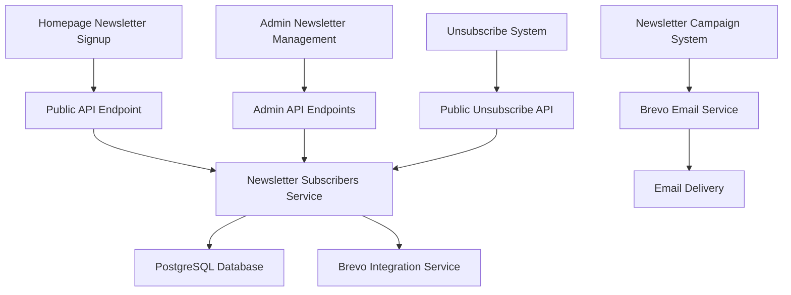

# Design Document

## Overview

This design outlines the implementation of a complete newsletter signup and management system that integrates a homepage newsletter signup component with the existing newsletter management infrastructure and Brevo email service. The solution will provide a seamless user experience for newsletter subscriptions while maintaining robust admin capabilities for subscriber management and campaign delivery.

## Architecture

### System Components



### Data Flow

1. **Subscription Flow**: Homepage form → Validation → Database storage → Brevo sync → Confirmation
2. **Campaign Flow**: Admin creates campaign → Subscriber list retrieval → Brevo delivery → Analytics tracking
3. **Unsubscribe Flow**: Email link → Unsubscribe page → Status update → Confirmation

## Components and Interfaces

### Frontend Components

#### 1. NewsletterSignup Component
- **Location**: `components/newsletter-signup.tsx`
- **Purpose**: Homepage newsletter subscription form
- **Props**:
  ```typescript
  interface NewsletterSignupProps {
    className?: string
    variant?: 'default' | 'compact' | 'inline'
    showNameFields?: boolean
    placeholder?: string
    buttonText?: string
  }
  ```
- **Features**:
  - Email validation
  - Optional name fields
  - Loading states
  - Success/error messaging
  - Responsive design
  - Accessibility compliance

#### 2. UnsubscribePage Component
- **Location**: `app/unsubscribe/page.tsx`
- **Purpose**: Handle newsletter unsubscription
- **Features**:
  - Token-based unsubscribe links
  - Confirmation UI
  - Resubscribe option
  - User-friendly messaging

### Backend Services

#### 1. Newsletter Subscribers Service Enhancement
- **Location**: `lib/database/services/newsletter-subscribers.ts`
- **New Methods**:
  ```typescript
  class NewsletterSubscribersService {
    static async subscribeFromHomepage(data: HomepageSubscriptionData): Promise<ServiceResult<NewsletterSubscriber>>
    static async unsubscribeByToken(token: string): Promise<ServiceResult<boolean>>
    static async generateUnsubscribeToken(subscriberId: string): Promise<string>
    static async reactivateSubscriber(email: string): Promise<ServiceResult<NewsletterSubscriber>>
  }
  ```

#### 2. Brevo Integration Enhancement
- **Location**: `lib/integrations/brevo.ts`
- **New Methods**:
  ```typescript
  class BrevoService {
    async syncSubscriber(subscriber: NewsletterSubscriber): Promise<SyncResult>
    async syncUnsubscribe(email: string): Promise<SyncResult>
    async createUnsubscribeLink(email: string, campaignId?: string): Promise<string>
  }
  ```

### API Endpoints

#### Public Endpoints

##### 1. Newsletter Subscription API
- **Endpoint**: `POST /api/newsletter/subscribe`
- **Purpose**: Handle homepage newsletter signups
- **Request Body**:
  ```typescript
  interface SubscriptionRequest {
    email: string
    firstName?: string
    lastName?: string
    source?: string // 'homepage', 'popup', etc.
  }
  ```
- **Response**:
  ```typescript
  interface SubscriptionResponse {
    success: boolean
    message: string
    subscriber?: NewsletterSubscriber
    error?: string
  }
  ```

##### 2. Newsletter Unsubscribe API
- **Endpoint**: `GET /api/newsletter/unsubscribe?token=<token>`
- **Purpose**: Handle unsubscribe requests from email links
- **Response**: Redirect to unsubscribe confirmation page

##### 3. Unsubscribe Confirmation API
- **Endpoint**: `POST /api/newsletter/unsubscribe`
- **Purpose**: Process unsubscribe confirmations
- **Request Body**:
  ```typescript
  interface UnsubscribeRequest {
    token: string
    confirmed: boolean
  }
  ```

#### Admin Endpoints (Existing - Enhanced)

##### Enhanced Subscriber Management
- **Endpoint**: `GET /api/admin/newsletter/subscribers`
- **Enhancement**: Include subscription source tracking
- **New Query Parameters**:
  - `source`: Filter by subscription source
  - `date_from`, `date_to`: Date range filtering

## Data Models

### Enhanced NewsletterSubscriber Model

```typescript
interface NewsletterSubscriber {
  id: string
  email: string
  first_name?: string
  last_name?: string
  status: 'active' | 'unsubscribed' | 'bounced'
  subscribed_at: string
  unsubscribed_at?: string
  tags?: string[]
  source?: string // New field: 'homepage', 'admin', 'import'
  unsubscribe_token?: string // New field for secure unsubscribe
  brevo_contact_id?: string // New field for Brevo sync
  last_synced_at?: string // New field for sync tracking
}
```

### Database Schema Updates

```sql
-- Add new columns to newsletter_subscribers table
ALTER TABLE newsletter_subscribers 
ADD COLUMN source VARCHAR(50) DEFAULT 'homepage',
ADD COLUMN unsubscribe_token VARCHAR(255) UNIQUE,
ADD COLUMN brevo_contact_id VARCHAR(255),
ADD COLUMN last_synced_at TIMESTAMP WITH TIME ZONE;

-- Create index for unsubscribe tokens
CREATE INDEX IF NOT EXISTS idx_newsletter_subscribers_unsubscribe_token 
ON newsletter_subscribers(unsubscribe_token);

-- Create index for source filtering
CREATE INDEX IF NOT EXISTS idx_newsletter_subscribers_source 
ON newsletter_subscribers(source);
```

## Error Handling

### Frontend Error Handling
- **Network Errors**: Retry mechanism with exponential backoff
- **Validation Errors**: Real-time field validation with user-friendly messages
- **Server Errors**: Graceful degradation with fallback messaging

### Backend Error Handling
- **Database Errors**: Transaction rollback and error logging
- **Brevo API Errors**: Graceful fallback to local storage with sync retry
- **Validation Errors**: Detailed error responses with field-specific messages

### Error Response Format
```typescript
interface ErrorResponse {
  error: string
  details?: string[]
  field?: string // For validation errors
  code?: string // Error code for client handling
}
```

## Testing Strategy

### Unit Tests
- **Components**: Newsletter signup form validation and submission
- **Services**: Subscriber management and Brevo integration
- **API Endpoints**: Request/response handling and error cases

### Integration Tests
- **Database Operations**: Subscriber CRUD operations
- **Brevo Integration**: Email sending and contact management
- **End-to-End Flow**: Complete subscription and unsubscription process

### Test Coverage Requirements
- **Minimum Coverage**: 80% for all new code
- **Critical Paths**: 95% coverage for subscription and unsubscription flows
- **Error Scenarios**: Comprehensive testing of all error conditions

### Test Data Management
- **Test Subscribers**: Isolated test data with cleanup procedures
- **Mock Services**: Brevo API mocking for reliable testing
- **Database Seeding**: Consistent test data setup and teardown

## Security Considerations

### Data Protection
- **Email Validation**: Server-side validation and sanitization
- **SQL Injection Prevention**: Parameterized queries and ORM usage
- **XSS Prevention**: Input sanitization and output encoding

### Unsubscribe Security
- **Token-Based Unsubscribe**: Cryptographically secure tokens
- **Token Expiration**: Time-limited unsubscribe links
- **Rate Limiting**: Prevent abuse of subscription endpoints

### Privacy Compliance
- **GDPR Compliance**: Right to be forgotten implementation
- **Data Minimization**: Collect only necessary subscriber information
- **Consent Tracking**: Record and manage user consent preferences

## Performance Optimization

### Frontend Performance
- **Component Lazy Loading**: Load newsletter signup component on demand
- **Form Optimization**: Debounced validation and optimistic UI updates
- **Bundle Size**: Minimize JavaScript payload for newsletter functionality

### Backend Performance
- **Database Indexing**: Optimized queries for subscriber operations
- **Caching Strategy**: Redis caching for frequently accessed subscriber data
- **Batch Processing**: Efficient bulk operations for large subscriber lists

### Brevo Integration Performance
- **Connection Pooling**: Reuse HTTP connections for API calls
- **Retry Logic**: Exponential backoff for failed API requests
- **Async Processing**: Background sync for non-critical operations

## Monitoring and Analytics

### Application Monitoring
- **Error Tracking**: Comprehensive error logging and alerting
- **Performance Metrics**: Response time and throughput monitoring
- **Health Checks**: Endpoint availability and dependency status

### Business Metrics
- **Subscription Rates**: Track conversion rates by source
- **Unsubscribe Rates**: Monitor churn and identify issues
- **Campaign Performance**: Email delivery and engagement metrics

### Alerting Strategy
- **Critical Alerts**: Database connectivity and Brevo API failures
- **Warning Alerts**: High error rates and performance degradation
- **Business Alerts**: Unusual subscription or unsubscribe patterns

## Deployment Strategy

### Environment Configuration
- **Development**: Local database with Brevo sandbox
- **Staging**: Production-like environment with test email lists
- **Production**: Full Brevo integration with monitoring

### Feature Flags
- **Newsletter Signup**: Toggle homepage signup component
- **Brevo Integration**: Enable/disable external email service
- **Enhanced Analytics**: Toggle advanced tracking features

### Rollback Plan
- **Database Migrations**: Reversible schema changes
- **Component Rollback**: Feature flag-based component switching
- **Service Degradation**: Graceful fallback to core functionality