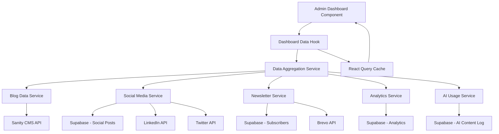
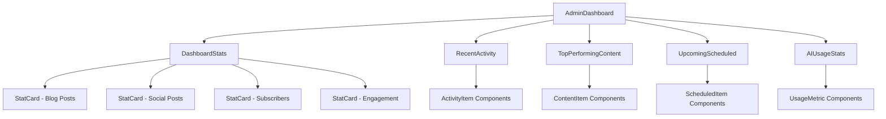

# Design Document

## Overview

This design document outlines the implementation approach for replacing mock data in the admin dashboard with real data from various sources including Supabase database, Sanity CMS, social media APIs, and AI usage logs. The solution will create a data layer that aggregates information from multiple sources and presents it through React components with proper loading states, error handling, and real-time updates.

## Architecture

### Data Flow Architecture



### Component Architecture



## Components and Interfaces

### 1. Data Services Layer

**Location**: `/lib/services/dashboard-data.ts`

```typescript
interface DashboardData {
  blogStats: {
    totalPosts: number;
    publishedThisMonth: number;
    growthPercentage: number;
  };
  socialStats: {
    totalPosts: number;
    postsThisWeek: number;
    totalEngagement: number;
    growthPercentage: number;
  };
  newsletterStats: {
    totalSubscribers: number;
    newSubscribersThisMonth: number;
    growthPercentage: number;
  };
  recentActivity: ActivityItem[];
  topPerformingContent: PerformingContentItem[];
  upcomingScheduled: ScheduledItem[];
  aiUsage: {
    contentGenerated: number;
    tokensUsed: number;
    timeSaved: number;
  };
}

interface ActivityItem {
  id: string;
  type: 'blog' | 'social' | 'newsletter' | 'ai';
  title: string;
  description: string;
  timestamp: Date;
  status: 'published' | 'scheduled' | 'sent' | 'generated';
  platform?: string;
}

interface PerformingContentItem {
  id: string;
  title: string;
  type: 'blog' | 'social' | 'newsletter';
  platform?: string;
  metrics: {
    views?: number;
    likes?: number;
    shares?: number;
    opens?: number;
    clicks?: number;
  };
}

interface ScheduledItem {
  id: string;
  title: string;
  type: 'blog' | 'social' | 'newsletter';
  platform?: string;
  scheduledAt: Date;
}
```

### 2. Blog Data Service

**Location**: `/lib/services/blog-data.ts`

```typescript
export class BlogDataService {
  async getBlogStats(): Promise<BlogStats> {
    // Fetch from Sanity CMS
    const posts = await sanityClient.fetch(`
      *[_type == "post"] {
        _id,
        publishedAt,
        _createdAt
      }
    `);
    
    const now = new Date();
    const thisMonth = posts.filter(post => 
      isThisMonth(new Date(post.publishedAt))
    ).length;
    
    const lastMonth = posts.filter(post => 
      isLastMonth(new Date(post.publishedAt))
    ).length;
    
    return {
      totalPosts: posts.length,
      publishedThisMonth: thisMonth,
      growthPercentage: calculateGrowth(thisMonth, lastMonth)
    };
  }
  
  async getRecentBlogActivity(): Promise<ActivityItem[]> {
    const recentPosts = await sanityClient.fetch(`
      *[_type == "post"] | order(publishedAt desc)[0...5] {
        _id,
        title,
        publishedAt,
        _createdAt
      }
    `);
    
    return recentPosts.map(post => ({
      id: post._id,
      type: 'blog',
      title: post.title,
      description: `Blog post published`,
      timestamp: new Date(post.publishedAt),
      status: 'published'
    }));
  }
}
```

### 3. Social Media Data Service

**Location**: `/lib/services/social-data.ts`

```typescript
export class SocialDataService {
  async getSocialStats(): Promise<SocialStats> {
    const { data: posts } = await supabase
      .from('social_posts')
      .select('*')
      .eq('status', 'published');
    
    const thisWeek = posts.filter(post => 
      isThisWeek(new Date(post.published_at))
    ).length;
    
    const lastWeek = posts.filter(post => 
      isLastWeek(new Date(post.published_at))
    ).length;
    
    // Aggregate engagement metrics
    const totalEngagement = posts.reduce((sum, post) => {
      const metrics = post.engagement_metrics || {};
      return sum + (metrics.likes || 0) + (metrics.shares || 0) + (metrics.comments || 0);
    }, 0);
    
    return {
      totalPosts: posts.length,
      postsThisWeek: thisWeek,
      totalEngagement,
      growthPercentage: calculateGrowth(thisWeek, lastWeek)
    };
  }
  
  async getTopPerformingSocialContent(): Promise<PerformingContentItem[]> {
    const { data: posts } = await supabase
      .from('social_posts')
      .select('*')
      .eq('status', 'published')
      .order('engagement_metrics->likes', { ascending: false })
      .limit(5);
    
    return posts.map(post => ({
      id: post.id,
      title: post.content.substring(0, 50) + '...',
      type: 'social',
      platform: post.platform,
      metrics: {
        likes: post.engagement_metrics?.likes || 0,
        shares: post.engagement_metrics?.shares || 0,
        comments: post.engagement_metrics?.comments || 0
      }
    }));
  }
}
```

### 4. Newsletter Data Service

**Location**: `/lib/services/newsletter-data.ts`

```typescript
export class NewsletterDataService {
  async getNewsletterStats(): Promise<NewsletterStats> {
    const { data: subscribers } = await supabase
      .from('newsletter_subscribers')
      .select('*')
      .eq('status', 'active');
    
    const thisMonth = subscribers.filter(sub => 
      isThisMonth(new Date(sub.subscribed_at))
    ).length;
    
    const lastMonth = subscribers.filter(sub => 
      isLastMonth(new Date(sub.subscribed_at))
    ).length;
    
    return {
      totalSubscribers: subscribers.length,
      newSubscribersThisMonth: thisMonth,
      growthPercentage: calculateGrowth(thisMonth, lastMonth)
    };
  }
  
  async getNewsletterCampaignStats(): Promise<PerformingContentItem[]> {
    const { data: campaigns } = await supabase
      .from('newsletter_campaigns')
      .select('*')
      .eq('status', 'sent')
      .order('open_rate', { ascending: false })
      .limit(3);
    
    return campaigns.map(campaign => ({
      id: campaign.id,
      title: campaign.subject,
      type: 'newsletter',
      metrics: {
        opens: Math.round(campaign.recipient_count * (campaign.open_rate / 100)),
        clicks: Math.round(campaign.recipient_count * (campaign.click_rate / 100))
      }
    }));
  }
}
```

### 5. Dashboard Data Hook

**Location**: `/hooks/use-dashboard-data.ts`

```typescript
export function useDashboardData() {
  const blogQuery = useQuery({
    queryKey: ['dashboard', 'blog'],
    queryFn: () => blogDataService.getBlogStats(),
    staleTime: 5 * 60 * 1000, // 5 minutes
  });
  
  const socialQuery = useQuery({
    queryKey: ['dashboard', 'social'],
    queryFn: () => socialDataService.getSocialStats(),
    staleTime: 5 * 60 * 1000,
  });
  
  const newsletterQuery = useQuery({
    queryKey: ['dashboard', 'newsletter'],
    queryFn: () => newsletterDataService.getNewsletterStats(),
    staleTime: 5 * 60 * 1000,
  });
  
  const recentActivityQuery = useQuery({
    queryKey: ['dashboard', 'activity'],
    queryFn: async () => {
      const [blog, social, newsletter] = await Promise.all([
        blogDataService.getRecentBlogActivity(),
        socialDataService.getRecentSocialActivity(),
        newsletterDataService.getRecentNewsletterActivity()
      ]);
      
      return [...blog, ...social, ...newsletter]
        .sort((a, b) => b.timestamp.getTime() - a.timestamp.getTime())
        .slice(0, 10);
    },
    staleTime: 2 * 60 * 1000, // 2 minutes
  });
  
  return {
    blogStats: blogQuery.data,
    socialStats: socialQuery.data,
    newsletterStats: newsletterQuery.data,
    recentActivity: recentActivityQuery.data,
    isLoading: blogQuery.isLoading || socialQuery.isLoading || newsletterQuery.isLoading,
    error: blogQuery.error || socialQuery.error || newsletterQuery.error,
    refetch: () => {
      blogQuery.refetch();
      socialQuery.refetch();
      newsletterQuery.refetch();
      recentActivityQuery.refetch();
    }
  };
}
```

### 6. Updated Dashboard Components

**Location**: `/app/admin/page.tsx`

```typescript
export default function AdminDashboard() {
  const { 
    blogStats, 
    socialStats, 
    newsletterStats, 
    recentActivity,
    isLoading, 
    error 
  } = useDashboardData();
  
  if (error) {
    return <ErrorState error={error} />;
  }
  
  return (
    <div className="space-y-6">
      {/* Stats Cards with real data */}
      <div className="grid grid-cols-1 md:grid-cols-2 lg:grid-cols-4 gap-6">
        <StatCard
          title="Total Blog Posts"
          value={blogStats?.totalPosts}
          change={blogStats?.growthPercentage}
          icon={FileText}
          isLoading={isLoading}
        />
        
        <StatCard
          title="Social Posts"
          value={socialStats?.totalPosts}
          change={socialStats?.growthPercentage}
          icon={Share2}
          isLoading={isLoading}
        />
        
        <StatCard
          title="Newsletter Subscribers"
          value={newsletterStats?.totalSubscribers}
          change={newsletterStats?.growthPercentage}
          icon={Users}
          isLoading={isLoading}
        />
        
        <StatCard
          title="Total Engagement"
          value={socialStats?.totalEngagement}
          change={socialStats?.engagementGrowth}
          icon={TrendingUp}
          isLoading={isLoading}
        />
      </div>
      
      {/* Recent Activity with real data */}
      <RecentActivityCard 
        activities={recentActivity} 
        isLoading={isLoading} 
      />
    </div>
  );
}
```

## Data Models

### Database Queries

```sql
-- Get blog post statistics (via Sanity API)
-- This will be handled through Sanity's GROQ queries

-- Get social media statistics
SELECT 
  COUNT(*) as total_posts,
  COUNT(CASE WHEN published_at >= date_trunc('week', now()) THEN 1 END) as posts_this_week,
  SUM(COALESCE((engagement_metrics->>'likes')::int, 0) + 
      COALESCE((engagement_metrics->>'shares')::int, 0) + 
      COALESCE((engagement_metrics->>'comments')::int, 0)) as total_engagement
FROM social_posts 
WHERE status = 'published';

-- Get newsletter statistics
SELECT 
  COUNT(*) as total_subscribers,
  COUNT(CASE WHEN subscribed_at >= date_trunc('month', now()) THEN 1 END) as new_this_month
FROM newsletter_subscribers 
WHERE status = 'active';

-- Get recent activity across all content types
SELECT 
  id, 
  'social' as type,
  content as title,
  published_at as timestamp,
  platform,
  status
FROM social_posts 
WHERE published_at >= now() - interval '7 days'
UNION ALL
SELECT 
  id,
  'newsletter' as type,
  subject as title,
  sent_at as timestamp,
  'email' as platform,
  status
FROM newsletter_campaigns 
WHERE sent_at >= now() - interval '7 days'
ORDER BY timestamp DESC
LIMIT 10;
```

## Error Handling

### Loading States

1. **Skeleton Components**: Show skeleton loaders for each stat card while data is loading
2. **Progressive Loading**: Load different sections independently to avoid blocking the entire dashboard
3. **Graceful Degradation**: Show partial data if some services are unavailable

### Error Recovery

1. **Retry Logic**: Automatic retry for failed API calls with exponential backoff
2. **Fallback Data**: Show cached data when real-time data is unavailable
3. **Error Boundaries**: Prevent dashboard crashes when individual components fail
4. **User Feedback**: Clear error messages with actionable next steps

### Data Validation

```typescript
const validateDashboardData = (data: any): DashboardData => {
  return {
    blogStats: {
      totalPosts: Math.max(0, data.blogStats?.totalPosts || 0),
      publishedThisMonth: Math.max(0, data.blogStats?.publishedThisMonth || 0),
      growthPercentage: isFinite(data.blogStats?.growthPercentage) ? data.blogStats.growthPercentage : 0
    },
    // ... similar validation for other stats
  };
};
```

## Testing Strategy

### Unit Testing

```typescript
// Test data services
describe('BlogDataService', () => {
  it('should fetch blog statistics correctly', async () => {
    const mockPosts = [
      { _id: '1', publishedAt: '2024-01-15', title: 'Test Post' }
    ];
    
    jest.spyOn(sanityClient, 'fetch').mockResolvedValue(mockPosts);
    
    const service = new BlogDataService();
    const stats = await service.getBlogStats();
    
    expect(stats.totalPosts).toBe(1);
    expect(stats.publishedThisMonth).toBeGreaterThanOrEqual(0);
  });
});

// Test dashboard hook
describe('useDashboardData', () => {
  it('should aggregate data from all services', async () => {
    const { result } = renderHook(() => useDashboardData());
    
    await waitFor(() => {
      expect(result.current.isLoading).toBe(false);
    });
    
    expect(result.current.blogStats).toBeDefined();
    expect(result.current.socialStats).toBeDefined();
  });
});
```

### Integration Testing

1. **API Integration**: Test actual API calls in staging environment
2. **Database Queries**: Verify database queries return expected data structure
3. **Component Integration**: Test dashboard components with real data
4. **Error Scenarios**: Test behavior when APIs are unavailable

## Performance Optimization

### Caching Strategy

1. **React Query**: Cache API responses with appropriate stale times
2. **Background Refetch**: Update data in background without blocking UI
3. **Selective Updates**: Only refetch changed data sections
4. **Optimistic Updates**: Show immediate feedback for user actions

### Data Fetching Optimization

```typescript
// Parallel data fetching
const fetchDashboardData = async () => {
  const [blogStats, socialStats, newsletterStats] = await Promise.allSettled([
    blogDataService.getBlogStats(),
    socialDataService.getSocialStats(),
    newsletterDataService.getNewsletterStats()
  ]);
  
  return {
    blogStats: blogStats.status === 'fulfilled' ? blogStats.value : null,
    socialStats: socialStats.status === 'fulfilled' ? socialStats.value : null,
    newsletterStats: newsletterStats.status === 'fulfilled' ? newsletterStats.value : null
  };
};
```

### Database Optimization

1. **Indexed Queries**: Ensure database indexes for frequently queried columns
2. **Aggregated Views**: Pre-calculate common statistics
3. **Connection Pooling**: Optimize database connection usage
4. **Query Optimization**: Use efficient SQL queries with proper joins

## Security Considerations

### Data Access Control

1. **Authentication**: Verify admin authentication before showing sensitive data
2. **API Security**: Secure all API endpoints with proper authentication
3. **Data Sanitization**: Sanitize all data before displaying in UI
4. **Rate Limiting**: Prevent abuse of data fetching endpoints

### Privacy Protection

1. **Subscriber Privacy**: Don't expose individual subscriber information
2. **Content Security**: Ensure only authorized content is displayed
3. **API Key Security**: Secure storage and usage of third-party API keys
4. **Audit Logging**: Log access to sensitive dashboard data